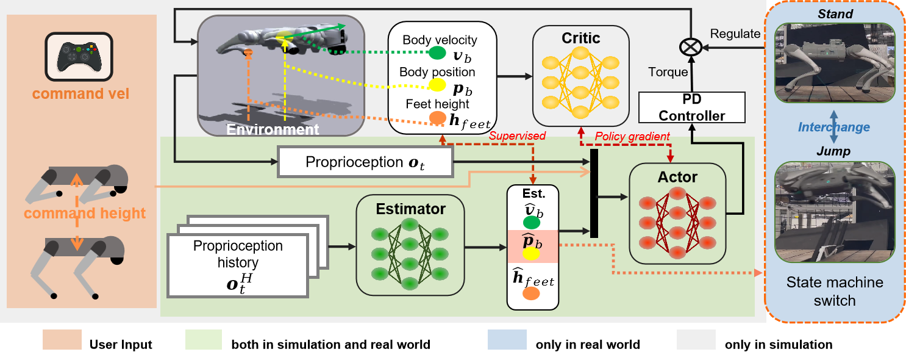
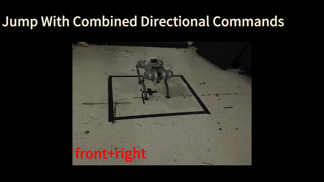
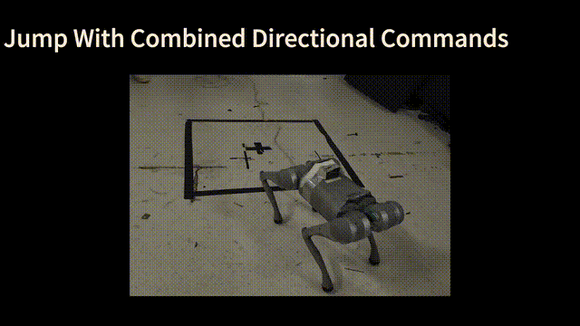
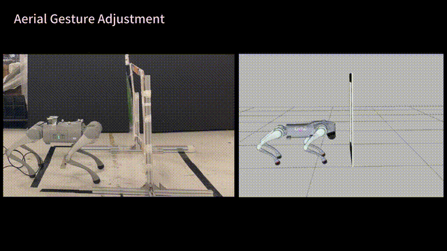
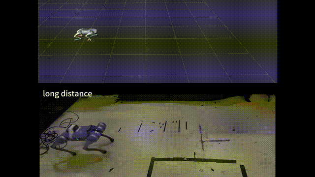

# OmniNet: Omnidirectional Jumping Neural Network With Height-Awareness for Quadrupedal Robots (RAL 2025)

### [Paper📄](https://ieeexplore.ieee.org/document/11045116/) ###

<p align="center">
    <strong>OmniNet: Omnidirectional Jumping Neural Network With Height-Awareness for Quadrupedal Robots</strong><br>
    Yimin Han, Jiahui Zhang, Zeren Luo, Yingzhao Dong, Jinghan Lin, Liu Zhao,<br>
    Shihao Dong, and Peng Lu<br>
    Adaptive Robotic Controls Lab (ArcLab), The University of Hong Kong.
</p>

### Demo ###
🎥 [Video](https://www.youtube.com/watch?v=1Weu46sxc78 )

### Overview ###

In the robotics community, it has been a longstanding
challenge for quadrupeds to achieve highly explosive movements
similar to their biological counterparts. In this work, we introduce a novel training framework that achieves height-aware and
omnidirectional jumping for quadrupedal robots. To facilitate the
precise tracking of the user-specified jumping height, our pipeline
concurrently trains an estimator that infers the robot and its
end-effector states in an online fashion. Besides, a novel reward
is involved by solving the analytical inverse kinematics with pre-
defined end-effector positions. Guided by this term, the robot is
empowered to regulate its gestures during the aerial phase. In the
comparative studies, we verify that this controller can not only
achieve the longest relative forward jump distance, but also exhibit
the most comprehensive jumping capabilities among all the existing
jumping controllers.

### Hardware Experiments ###
#### Multi-directional Jump

<p align="center">
    
    
</p>

#### Frame Traversing
To better demonstrate the robot’s ability to adjust its gesture in the air, we conducted a frame-traversing experiment with the robot. The robot needs to pull its legs close to the trunk in the air, in order to jump through the frame without collision.
<p align="center">
    
</p>

#### Running Jump
To explore the potential of our framework in accommodating different gaits, we combined one trotting policy and jumping policy together. The estimated height is the key for the controller switch in the low-level control loop. The experiments showcase that our framework can empower the robot’s movement to maintain continuity during gait transitions.
<p align="center">
    
</p>

### CODE STRUCTURE ###
1. Each environment is defined by an env file (`legged_robot.py`) and a config file (`legged_robot_config.py`). The config file contains two classes: one conatianing all the environment parameters (`LeggedRobotCfg`) and one for the training parameters (`LeggedRobotCfgPPo`).  
2. Both env and config classes use inheritance.  
3. Each non-zero reward scale specified in `cfg` will add a function with a corresponding name to the list of elements which will be summed to get the total reward.  
4. Tasks must be registered using `task_registry.register(name, EnvClass, EnvConfig, TrainConfig)`. This is done in `envs/__init__.py`, but can also be done from outside of this repository.  

### Installation ###
1. Create a new python virtual env with python 3.6, 3.7 or 3.8 (3.8 recommended)
2. Install pytorch 1.10 with cuda-11.3:
    - `pip3 install torch==1.10.0+cu113 torchvision==0.11.1+cu113 torchaudio==0.10.0+cu113 -f https://download.pytorch.org/whl/cu113/torch_stable.html`
3. Install Isaac Gym
   - Download and install Isaac Gym Preview 3 (Preview 2 will not work!) from https://developer.nvidia.com/isaac-gym
   - `cd isaacgym/python && pip install -e .`
   - Try running an example `cd examples && python 1080_balls_of_solitude.py`
   - For troubleshooting check docs `isaacgym/docs/index.html`)
4. Install rsl_rl (PPO implementation)
   - Clone https://github.com/leggedrobotics/rsl_rl
   -  `cd rsl_rl && pip install -e .` 
5. Install legged_gym
    - Clone this repository
   - `cd legged_gym && pip install -e .`

### Usage ###
This repo only contains the RL policy part. For omni-jumping, gen_his algorithm fits the task best. Task-specific rewards are set in the legged_gym/envs/base/legged_robot.py and the config should also be tuned in legged_gym/envs/go2/go2_config_baseline.py \\
1. Train: 
  ```python legged_gym/legged_gym/script/train.py --task=go1 --num_envs=1800```
    -  To run on CPU add following arguments: `--sim_device=cpu`, `--rl_device=cpu` (sim on CPU and rl on GPU is possible).
    -  To run headless (no rendering) add `--headless`.
    - **Important**: To improve performance, once the training starts press `v` to stop the rendering. You can then enable it later to check the progress.
    - The trained policy is saved in `issacgym_anymal/logs/<experiment_name>/<date_time>_<run_name>/model_<iteration>.pt`. Where `<experiment_name>` and `<run_name>` are defined in the train config.
    -  The following command line arguments override the values set in the config files:
     - --task TASK: Task name.
     - --resume:   Resume training from a checkpoint
     - --experiment_name EXPERIMENT_NAME: Name of the experiment to run or load.
     - --run_name RUN_NAME:  Name of the run.
     - --load_run LOAD_RUN:   Name of the run to load when resume=True. If -1: will load the last run.
     - --checkpoint CHECKPOINT:  Saved model checkpoint number. If -1: will load the last checkpoint.
     - --num_envs NUM_ENVS:  Number of environments to create(1800 in my case).
     - --seed SEED:  Random seed.
     - --max_iterations MAX_ITERATIONS:  Maximum number of training iterations.
2. Play a trained policy:  
```python legged_gym/legged_gym/script/play.py --task=go1```
    - By default the loaded policy is the last model of the last run of the experiment folder.
    - Other runs/model iteration can be selected by setting `load_run` and `checkpoint` in the train config.
3. Play a trained policy with Joystick:
```python legged_gym/legged_gym/script/play_joy.py --task=go1```
    - Plug in the X-Box joystick, open another terminal:
```rosrun joy joy_node```
    - Please make sure your PC has installed ROS melodic or other version of ROS

### Adding a new environment ###
The base environment `legged_robot` implements a rough terrain locomotion task. The corresponding cfg does not specify a robot asset (URDF/ MJCF) and no reward scales. 

1. Add a new folder to `envs/` with `'<your_env>_config.py`, which inherit from an existing environment cfgs  
2. If adding a new robot:
    - Add the corresponding assets to `resourses/`.
    - In `cfg` set the asset path, define body names, default_joint_positions and PD gains. Specify the desired `train_cfg` and the name of the environment (python class).
    - In `train_cfg` set `experiment_name` and `run_name`
3. (If needed) implement your environment in <your_env>.py, inherit from an existing environment, overwrite the desired functions and/or add your reward functions.
4. Register your env in `isaacgym_anymal/envs/__init__.py`.
5. Modify/Tune other parameters in your `cfg`, `cfg_train` as needed. To remove a reward set its scale to zero. Do not modify parameters of other envs!

### Citation ###
If you find this work useful, please cite:

```bibtex
@article{han2025omninet,
    title={Omninet: Omnidirectional jumping neural network with height-awareness for quadrupedal robots},
    author={Han, Yimin and Zhang, Jiahui and Luo, Zeren and Dong, Yingzhao and Lin, Jinghan and Zhao, Liu and Dong, Shihao and Lu, Peng},
    journal={IEEE Robotics and Automation Letters},
    year={2025},
    publisher={IEEE}
}
```
### LICENSE ###
This repositorie is licensed under GPLv3 license. International License and is provided for academic purpose. If you are interested in our project for commercial purposes, please contact [Dr. Peng Lu](https://arclab.hku.hk/People.html) for further communication.